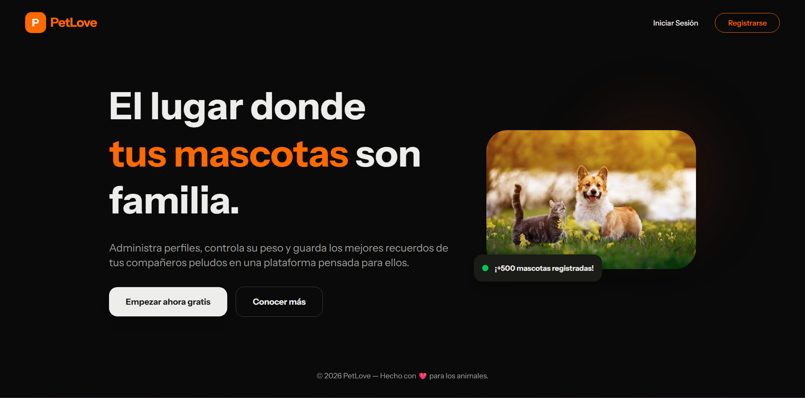
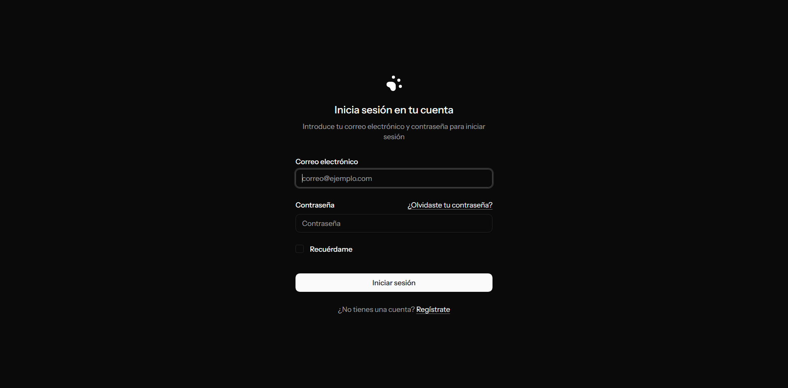
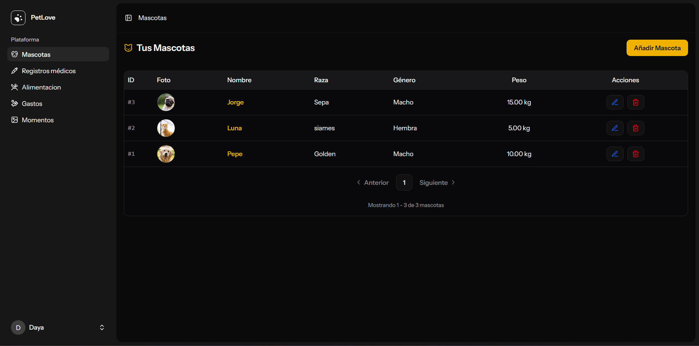
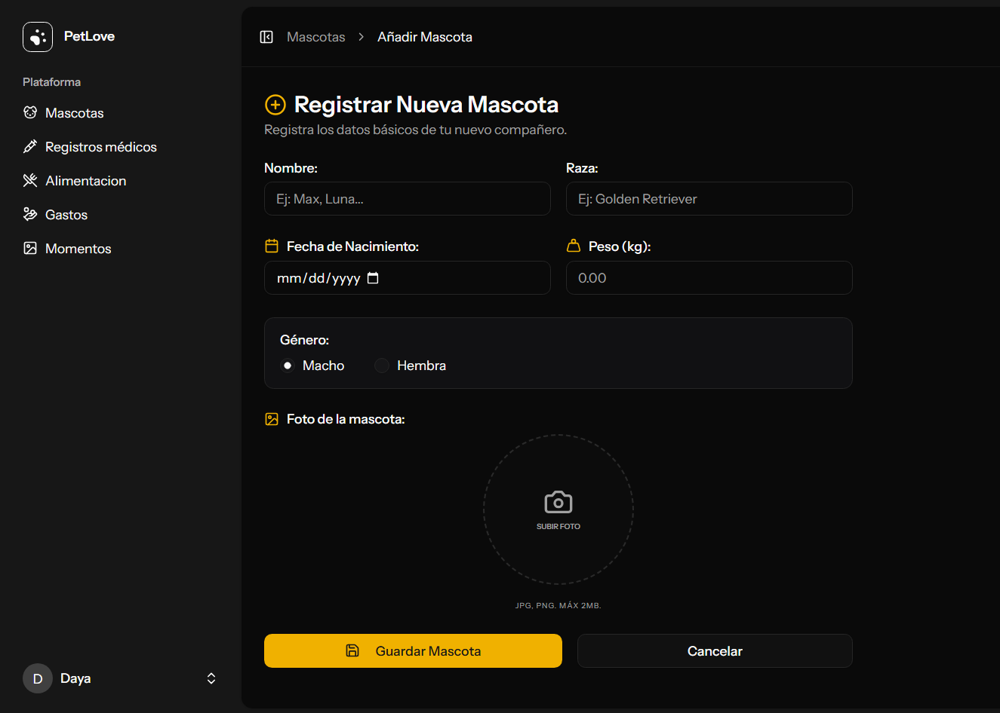
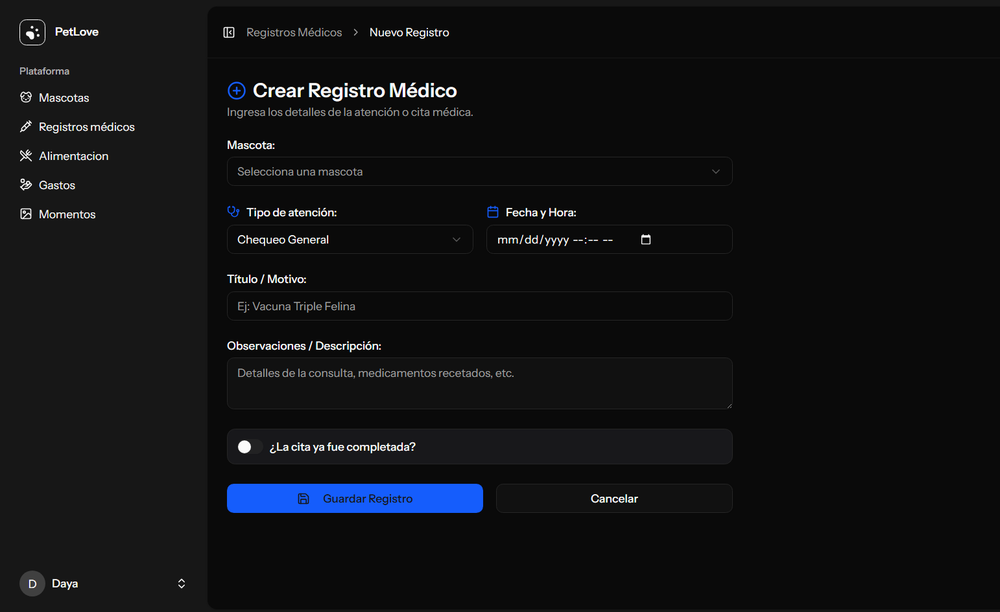
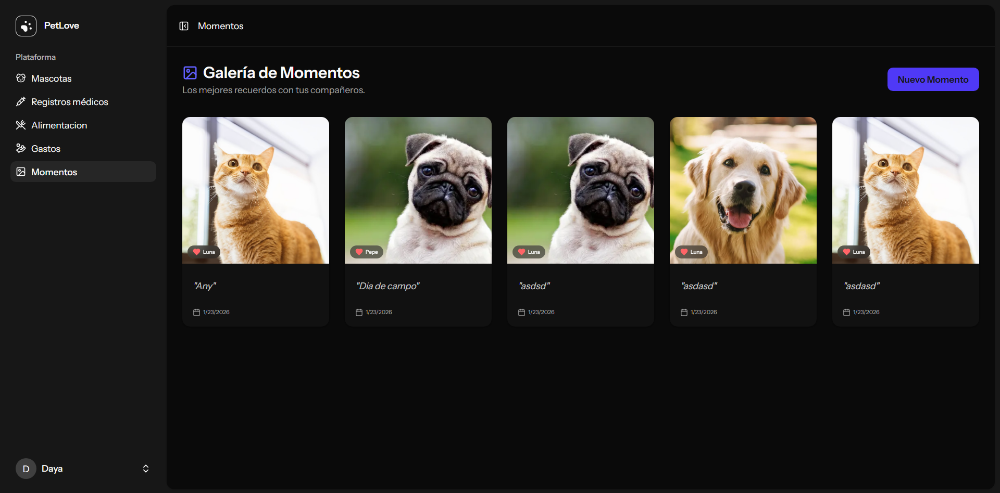
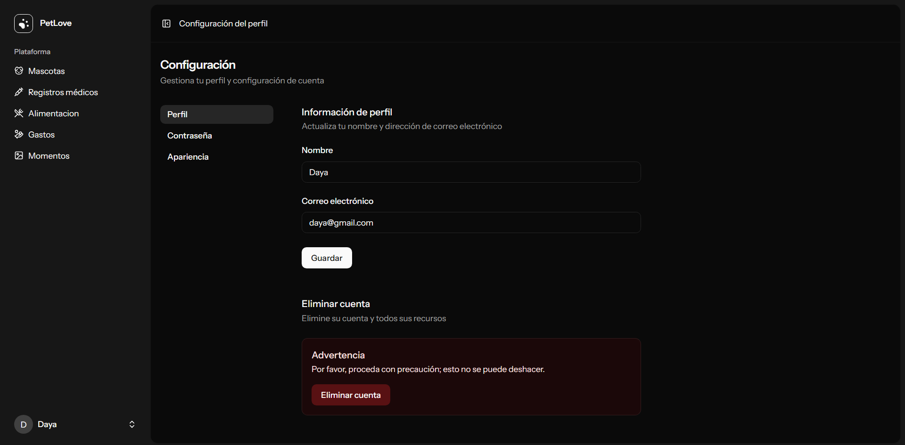

# 🐾 PetLove - Sistema de Gestión de Cuidado de Mascotas

<p align="center">
  
  <br>
  <em>Solución integral Full-Stack para la administración de clínicas veterinarias y bienestar animal.</em>
</p>

---

## 🚀 Descripción del Proyecto
**PetLove** es una aplicación diseñada para centralizar la gestión de mascotas, historias clínicas y citas. El sistema permite administrar expedientes médicos de forma eficiente y ofrece a los usuarios una interfaz clara para el seguimiento de sus mascotas.

---

## 🛠️ Stack Tecnológico

| Capa | Tecnologías |
| :--- | :--- |
| **Frontend** |   |
| **Backend** |   |
| **Base de Datos** |  |
| **Otros** |   |

---

## 📸 Galería de la Aplicación

| Inicio de Sesión | Listado de Mascotas |
| :---: | :---: |
|  |  |

| Agregar Mascota | Gestión de Citas |
| :---: | :---: |
|  |  |

| Galería de Momentos | Configuración de Usuario |
| :---: | :---: |
|  |  |

---

## ⚙️ Instalación y Configuración

Sigue estos pasos para levantar el proyecto localmente:

### 1. Clonar el repositorio
```bash
git clone [https://github.com/tu-usuario/nombre-del-repo.git](https://github.com/tu-usuario/nombre-del-repo.git)
